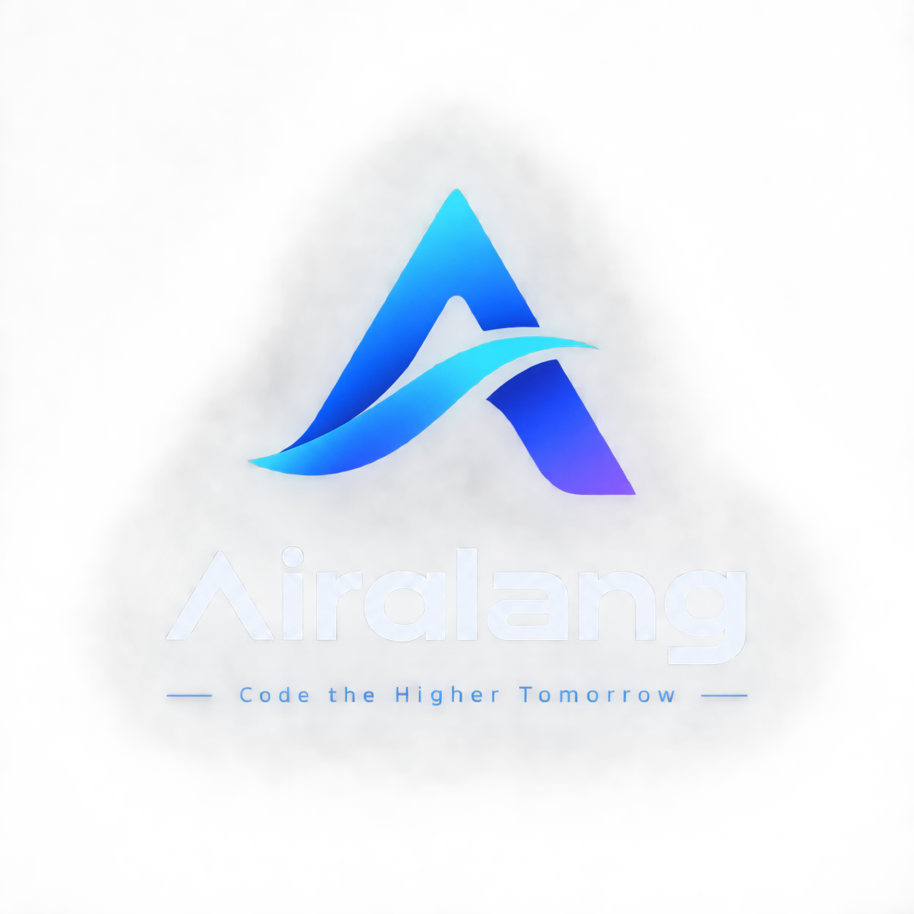

# 📱 AiraLang Mobile Studio — Official Android IDE

  

Official standalone mobile IDE for **AiraLang**, engineered from the ground up for mobile developers, creators, and systems engineers. 

> **Creator & Systems Architect:** Adam Eehan (Founder & CEO, Aira Group of Technology)  
> **Package ID:** `com.airagroup.airalang`  
> **Release Version:** `v1.4.5` (Build 1)  
> **Target OS:** Android 8.0 to Android 15+ (API 26 - 37)  
> **Supported Chipsets:** `arm64-v8a`, `armeabi-v7a`, `x86_64`  

---

## 📥 Direct APK Download

| Package Name | Architecture | File Size | Direct Download |
| :--- | :--- | :--- | :--- |
| **AiraLang Studio (Official Release)** | Universal (`arm64-v8a` / `armeabi-v7a` / `x86_64`) | **40.6 MB** | [⬇️ **Download AiraLang-Studio.apk**](./AiraLang-Studio.apk) |

---

## ⚡ Key Highlights & Architecture

### 1. 100% Native Embedded CPython Runtime (Chaquopy Engine)
* Bundles the exact, authentic **AiraLang AST Engine** directly from this repository (`lexer.py`, `parser.py`, `evaluator.py`, `stdlib_modules.py`).
* Runs `.aira` scripts on-device without needing Termux, PC, or internet connection.

### 2. All 14 Standard Library Modules Live on Mobile
* `proposal` — Romance sentiment analyzer and automated timeout verification.
* `crypto` — SHA-256, MD5, HMAC, Base64 encode/decode.
* `ai` — Aira Ultra 3 On-Device Intelligence Engine.
* `sqlite` — Local relational database operations.
* `net` / `http` — Networking and web requests.
* `sec` / `droidsec` — Android hardware trust chain & memory telemetry.
* `time`, `math`, `json`, `system`, `file`, `thread` — Full systems capabilities.

### 3. VS Code Dark+ Mobile IDE Interface
* **Dedicated to AiraLang:** Strict `.aira` source file management.
* **Quick Access Mobile Keyboard:** Instant insertion for `let`, `say`, `fn`, `import`, `≠`, `;`, `{}`, `()`, `""`.
* **Signature Semicolon Auto-Fixer:** Automatically detects and heals missing semicolons in source files.
* **Sliding Terminal Console:** Pydroid-style interactive output terminal with ANSI color streaming.
* **"Aira Reading AiraLang" Thinking Bar:** Dynamic braille spinner animation during AST specification inspection.

---

## 📲 How to Install on Android

1. Download [`AiraLang-Studio.apk`](./AiraLang-Studio.apk) directly to your Android device.
2. Open the file from your **Downloads** or Notifications tray.
3. If prompted, allow **"Install from unknown sources"** for your browser / file manager.
4. Tap **Install** and open **AiraLang Studio**.
5. Start writing and running `.aira` code immediately on your phone!

---

*© 2026 Aira Group of Technology • Founded by Adam Eehan*
